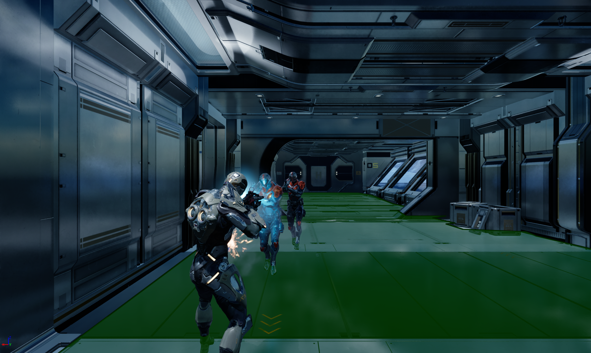
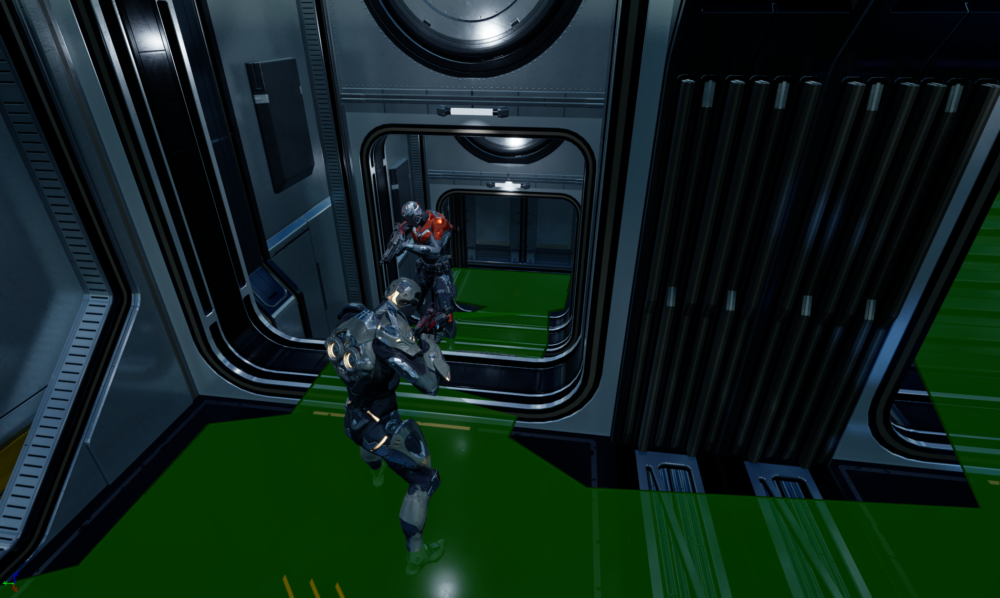

<!-- success warning error note -->
{: .box-success}
**Predator AI** is a prototype game developed in Unreal Engine, showcasing advanced enemy AI systems. The project highlights intelligent enemy behaviors such as patrolling, chasing, and attacking the player, with decision-making systems implemented in C++ and refined using Blueprints for flexibility and iteration.

### Key Features

- **Enemy AI Behaviors** – Patrolling, chasing, attacking, and reacting to the player.
- **Dynamic Combat** – Enemies switch between melee and ranged combat depending on the situation.
- **Perception System** – Vision and detection when the AI notices the player.
- **Audio Awareness** – Enemies can listen for player actions, reacting to sounds like footsteps or gunfire.
- **Cover Tactics** – AI can decide when to hide and ambush the player from cover.
- **Hybrid Workflow** – Core logic in C++, with Blueprints for animation and behavior tuning.
- **Gameplay Focused on AI** – Designed specifically to demonstrate responsive and adaptive enemy AI.
- **Optimized Performance** – C++ implementation ensures scalability for more complex AI.

This project was also great learning experience, helping me understand the fundamentals of Unreal Engine, Implementing C++ in Unreal Engine, Core Game Mechanics and Advanced Enemy AI using Behaviour Trees. I'm looking forward to building even more exciting games in the future!

**Game Images**-

 

Thank you for reading about my journey with **Predator AI**.
