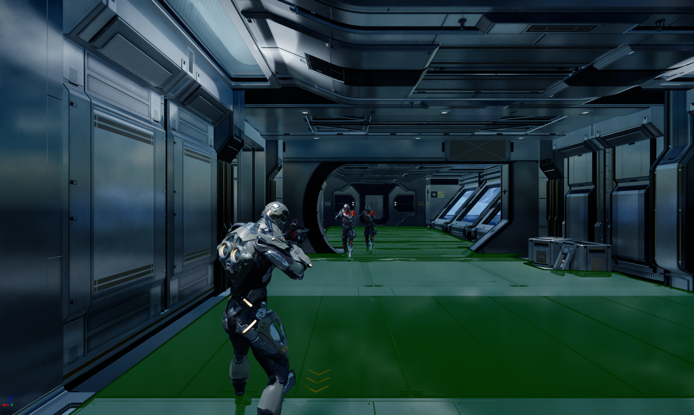

<!-- success warning error note -->
{: .box-success}
**Predator AI** is a prototype game developed in Unreal Engine 5, showcasing advanced enemy AI systems. The project highlights intelligent enemy behaviors such as patrolling, chasing, and attacking the player, with decision-making systems implemented in C++ and refined using Blueprints for flexibility and iteration.

I'm excited to share details about my Fifth game project: **Predator AI**.

**Predator AI** is my first game project, a 2D platformer developed in Unreal Engine. The player shoots fireballs at enemies while avoiding traps such as spikes, swinging hammers, and rotating blades. Enemies patrol the level, chase the player when detected, and launch close-range attacks, while health crates give players a chance to survive longer in challenging encounters.

### Key Features

- **Enemy AI Behaviors** – Patrolling, chasing, attacking, and reacting to the player.
- **Dynamic Combat** – Enemies switch between melee and ranged combat depending on the situation.
- **Perception System** – Vision and detection coded in C++ for efficiency.
- **Hybrid Workflow** – Core logic in C++, with Blueprints for animation and behavior tuning.
- **Gameplay Focused on AI** – Designed specifically to demonstrate responsive and adaptive enemy AI.
- **Optimized Performance** – C++ implementation ensures scalability for more complex AI.

This project was also great learning experience, helping me understand the fundamentals of Unreal Engine, Implementing C++ in Unreal Engine, Core Game Mechanics and Advanced Enemy AI using Behaviour Trees. I'm looking forward to building even more exciting games in the future!

**Game Images**-

 

Thank you for reading about my journey with **Predator AI**.