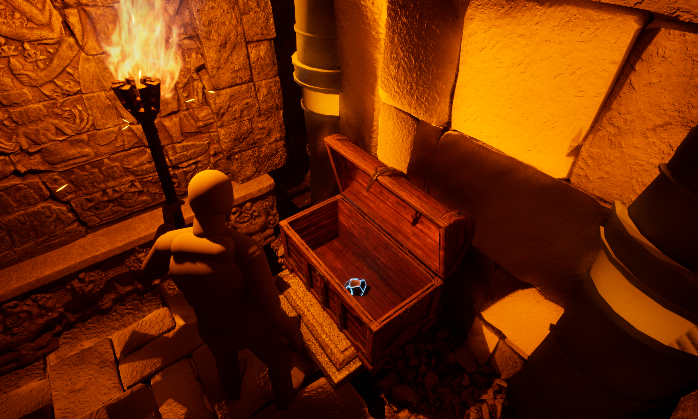
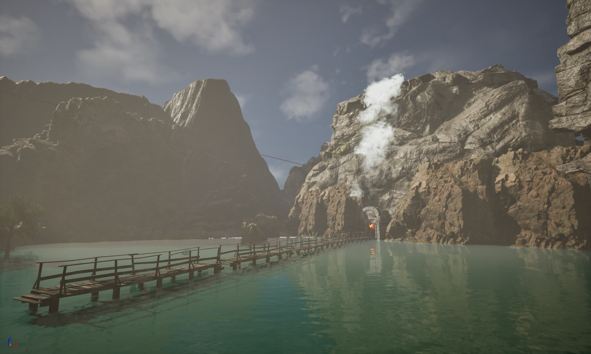

<!-- success warning error note -->
{: .box-success}
**Adventurious Jungle** is a gameplay prototype developed in Unreal Engine, focused on environmental interaction systems, conditional AI behavior, and quest-driven progression within an ancient jungle setting. The prototype emphasizes exploration, puzzle logic, and player–environment interaction, serving as a foundation for expanded survival mechanics.

The core objective of this prototype is to validate gameplay logic, AI reactions based on player state, and level design flow in a dense, atmospheric jungle environment inspired by ancient ruins.

### Key Features

- **Environmental Interaction Systems** – Pressure plates and lever-based mechanisms used to control doors and progression.
- **Puzzle-Based Progression** – A gated objective where a door unlocks only after five crystals are placed in their grooves and a flame torch is lit.
- **Exploration-Driven Gameplay** – Players must explore the dense jungle environment to locate key items required for progression.
- **Conditional Animal AI** – Wildlife behavior changes based on the player’s equipment state.
- **AI Threat Response** – Wolves retreat when the player carries a weapon or lit torch, but chase and attack when the player is unarmed.
- **Atmospheric Level Design** – A dense, ancient jungle environment designed to increase tension and challenge through layout and visibility.

### Future Scope

The prototype is planned to be expanded with a full inventory system to manage resources, weapons, and quest items, along with a crafting system that allows players to create tools, weapons, and survival equipment using collected materials. A dedicated hunting system will introduce additional wildlife with deeper risk–reward mechanics tied to food and resource management. The game will also include multiple weapon types with varied effectiveness, encouraging strategic preparation and equipment choices, further enhancing the overall survival and progression-focused gameplay experience.

Developing Adventurious Jungle as a prototype helped me strengthen my skills in game logic design, environmental puzzles, quest systems, conditional AI behavior, and level design in Unreal Engine. The project demonstrates my ability to plan scalable systems, prototype survival mechanics, and design exploration-focused gameplay suitable for future expansion.

**Game Images**-

<!-- Thank you for reading about my journey with **Predator AI**. -->
